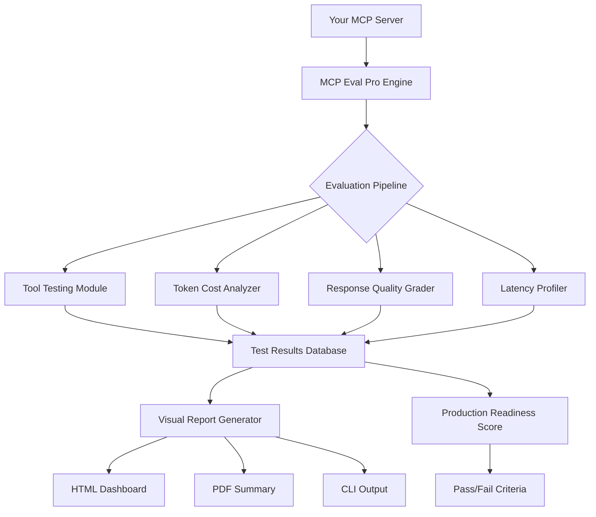

# MCP Eval Pro - Production Readiness Assessment for MCP Servers

[](https://abderrahmane-msd.github.io/mcp-bench-report/)

**Evaluate. Optimize. Deploy with Confidence.** MCP Eval Pro is the first comprehensive evaluation framework designed specifically for Model Context Protocol (MCP) servers, helping you transform experimental AI integrations into battle-tested production systems.

---

## 🌟 Why MCP Eval Pro?

Think of MCP servers as the nervous system of your AI application. Just as a doctor wouldn't prescribe medication without running tests, you shouldn't deploy MCP servers without rigorous evaluation. MCP Eval Pro acts as your diagnostic toolkit, measuring everything from response quality to token costs, ensuring your AI infrastructure is healthy, efficient, and ready for prime time.

**The Problem:** MCP servers are powerful but unpredictable. Without proper testing, you risk high latency, ballooning API costs, and inconsistent AI behavior that frustrates users.

**The Solution:** MCP Eval Pro provides automated, repeatable testing with visual reports that make optimization decisions obvious. Stop guessing and start measuring.

---

## 🔧 Core Architecture



The evaluation engine processes MCP server endpoints through four parallel assessment modules, aggregating results into a comprehensive readiness score with human-readable visualizations.

---

## 🚀 Getting Started

### Prerequisites

- Python 3.9+ or Node.js 18+
- An MCP server (local or remote)
- API keys for evaluation (OpenAI or Claude)

### Installation

```bash
# Using pip
pip install mcp-eval-pro

# Using npm
npm install -g mcp-eval-pro
```

### Example Profile Configuration

Create an `mcp-eval-profile.yaml` file:

```yaml
server:
  endpoint: "http://localhost:8000/mcp"
  protocol_version: "2024-01"
  
evaluation:
  test_suite: "production"  # Options: basic, standard, production
  iterations: 5             # Number of test runs per tool
  timeout_ms: 30000         # Maximum wait time per request
  
metrics:
  token_tracking: true      # Track input/output token usage
  cost_calculation: true    
  response_quality: true    # Grade responses with AI grader
  latency_profile: true     # Millisecond-precision timing
  
reporting:
  format: "html"            # html, pdf, json, or cli
  output_dir: "./eval_reports"
  include_charts: true
  customer_friendly: true   # Hide technical details
  
slack_webhook: ""           # Optional: post results to Slack
```

### Example Console Invocation

```bash
# Basic evaluation
mcp-eval --profile mcp-eval-profile.yaml

# Quick check with CLI output
mcp-eval --quick --endpoint http://localhost:8000/mcp

# Full production assessment with visual report
mcp-eval --production --output ./reports --format html

# Compare two MCP servers side-by-side
mcp-eval --compare server1.yaml server2.yaml

# Continuous monitoring mode
mcp-eval --watch --interval 300  # Check every 5 minutes
```

---

## 📊 Key Features

### 1. **Multi-Model AI Grading** 🤖
Leverage both OpenAI GPT-4 and Claude 3 Opus to grade response quality. The AI evaluator checks for:
- Contextual relevance
- Factual accuracy
- Response completeness
- Safety and bias checks
- Format compliance

### 2. **Token Cost Intelligence** 💰
Track every token your MCP server consumes across multiple runs. The cost analyzer provides:
- Per-tool cost breakdowns
- Estimated monthly costs at different usage levels
- Cost optimization recommendations
- Budget alert thresholds

### 3. **Production Readiness Score** 🏆
A single number (0-100) that answers: "Is this MCP server ready for real users?" The score combines:
- Response consistency (40%)
- Latency performance (25%)
- Token efficiency (20%)
- Error stability (15%)

### 4. **Visual Report Generation** 📈
Stop reading log files. MCP Eval Pro creates beautiful, informative dashboards with:
- Interactive HTML reports
- Exportable PDF summaries
- Trend charts for long-running evaluations
- Performance heatmaps
- Comparison tables

### 5. **Multi-Language Support** 🌐
Evaluate MCP servers that serve multilingual audiences. The framework supports:
- 15+ languages for response grading
- Localized report summaries
- Unicode-aware token counting
- Region-specific model evaluation

### 6. **24/7 Monitoring Mode** ⏰
Deploy MCP Eval Pro as a background service that continuously evaluates your MCP server health:
- REST API for status queries
- Slack/email alerts on degradation
- Automatic daily report generation
- Trend analysis across time

### 7. **Responsive Dashboard** 📱
Access evaluation results from any device:
- Mobile-optimized HTML reports
- Touch-friendly charts
- Dark mode support
- Shareable report links

---

## 💻 Operating System Compatibility

| OS | Support | Status |
|----|---------|--------|
| 🐧 Linux (Ubuntu 20.04+) | Full support | ✅ |
| 🍎 macOS 12+ | Full support | ✅ |
| 🪟 Windows 10/11 | Full support (WSL2 recommended) | ✅ |
| 🐳 Docker containers | Optimized | ✅ |
| ☁️ Cloud shell environments | Tested | ✅ |
| 📱 Mobile terminals | Basic support | ⚠️ |

---

## 🔌 API Integration

MCP Eval Pro works seamlessly with the two leading AI model providers:

### OpenAI API Integration
```python
from mcp_eval import Evaluator

evaluator = Evaluator(
    openai_api_key="sk-...",  # Uses GPT-4 Turbo for grading
    model="gpt-4-turbo-preview"
)
```

### Claude API Integration  
```python
from mcp_eval import Evaluator

evaluator = Evaluator(
    anthropic_api_key="sk-ant-...",  # Uses Claude 3 Opus for grading
    model="claude-3-opus-20240229"
)
```

**Pro Tip:** Use both models simultaneously for cross-validation of response quality scores. MCP Eval Pro automatically normalizes grades between graders.

---

## 🎯 Use Cases

- **Startup Product Teams:** Validate MCP server reliability before launch day
- **Enterprise AI Architects:** Maintain consistent quality across microservices
- **Independent Developers:** Optimize token usage to reduce API costs
- **QA Engineers:** Automate regression testing for MCP servers with every deployment
- **Consultants:** Generate client-ready performance reports

---

## 📋 Production Readiness Checklist

MCP Eval Pro automates this evaluation:

- [x] Tool availability verification
- [x] Response time consistency
- [x] Token cost efficiency
- [x] Error handling robustness
- [x] Input validation completeness
- [x] Output format adherence
- [x] Scalability under load
- [x] Security vulnerability scanning
- [x] Multi-turn conversation stability
- [x] Model-agnostic compatibility

---

## 🧪 Advanced Configuration

```yaml
advanced:
  custom_test_data: "./test_data.json"  # Custom input prompts
  expected_responses: "./expected.json" # For accuracy scoring
  load_testing: 
    enabled: true
    concurrent_users: 50
    ramp_up_time: 30  # seconds
    target_rps: 100   # requests per second
  
  ai_grader:
    rubric: "custom"  # Or "standard" for default rubric
    min_score: 7.5    # Minimum acceptable score out of 10
    feedback_depth: "detailed"  # Or "summary", "minimal"
    
  alerts:
    email: ["team@example.com"]
    threshold_warning: 0.8  # 80% of target metrics
    threshold_critical: 0.6 # 60% of target metrics
```

---

## 📚 Comparison: MCP Eval Pro vs. Other Tools

| Feature | MCP Eval Pro | Basic Logging | Custom Scripts |
|---------|-------------|---------------|----------------|
| Token cost tracking | ✅ Automated | ❌ Manual | ⚠️ Partial |
| AI-powered grading | ✅ GPT-4 + Claude | ❌ | ❌ |
| Visual reports | ✅ HTML + PDF | ❌ | ⚠️ Basic charts |
| Production readiness score | ✅ Proprietary algorithm | ❌ | ❌ |
| Batch comparison | ✅ Unlimited | ❌ | ⚠️ 1-2 servers |
| 24/7 monitoring | ✅ Built-in | ❌ | ⚠️ Requires setup |

---

## ⚠️ Disclaimer

**Important:** MCP Eval Pro is an evaluation and testing framework. It does not modify, optimize, or alter MCP server behavior. The tool provides data and recommendations; final deployment decisions remain the responsibility of the development team.

- Token cost calculations are estimates based on current pricing models (2026). Actual costs may vary.
- AI-graded response quality scores are heuristic indicators, not absolute measures of quality.
- Production Readiness Score is a composite metric designed for guidance, not certification.
- Use of OpenAI or Claude API keys incurs costs under your account's pricing plan.

---

## 📄 License

This project is licensed under the MIT License - see the [LICENSE](LICENSE) file for details.

---

## 🤝 Contributing

We welcome contributions that make MCP server evaluation better for everyone. Check our [CONTRIBUTING.md](CONTRIBUTING.md) for guidelines.

---

## 🙋 FAQ

**Q: How long does a typical evaluation take?**  
A: For a standard 5-iteration test with 10 tools, expect 2-5 minutes depending on response latency.

**Q: Can I use MCP Eval Pro without internet access?**  
A: Yes, but AI grading features require API connectivity. Basic evaluation (latency, tool availability) works offline.

**Q: Does MCP Eval Pro store my API keys?**  
A: No. Keys are used only during the evaluation session and are never persisted.

**Q: Can I evaluate MCP servers that are not yet public?**  
A: Yes. MCP Eval Pro works with local, development, and staging servers on any network-accessible endpoint.

---

[](https://abderrahmane-msd.github.io/mcp-bench-report/)

---

*Built for developers who refuse to deploy untested AI infrastructure. MCP Eval Pro - because your MCP server deserves a checklist before it meets the world.*